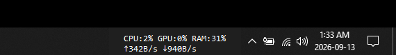

taskbar-system-monitor
=======================


A tiny always-on-top text readout that docks itself right next to your Windows system tray, showing live **CPU**, **GPU**, **RAM**, and **network upload/download** stats — no hovering required.

## Screenshot

This is the real, live overlay running on the taskbar (not a mockup):



## Contents

- [Features](#features)
- [Quick start](#quick-start)
- [Configuring the font](#configuring-the-font)
- [Auto-start on boot](#auto-start-on-boot)
- [How it works](#how-it-works)
- [Requirements](#requirements)

## Features

- Live `CPU:xx% GPU:xx% RAM:xx%` and `↑upload ↓download` readout, updated every 1.5s
- Auto-detects your GPU — tries `nvidia-smi` first, falls back to Windows' built-in GPU performance counters, shows `N/A` if neither is available
- Network speed auto-scales between `B/s`, `KB/s`, `MB/s` (real bytes, not bits)
- Matches your taskbar's light/dark theme automatically
- Right-click the overlay to bump the font size up/down (saved to `config.json`) or quit
- Single-instance guarded — launching it twice just no-ops instead of stacking duplicate overlays
- Lightweight: no visible window in the taskbar/alt-tab list, minimal footprint at idle

## Quick start

```powershell
pip install -r requirements.txt
python cpu_monitor.py
```

Or double-click `start_monitor.vbs` to launch it silently with no console window (uses `pythonw.exe`).

<details>
<summary>Optional: NVIDIA GPU users</summary>

If `nvidia-smi` is on your `PATH` (it ships with the standard NVIDIA driver), GPU usage is read directly from it — the most accurate source. If it's not found, the app falls back to Windows' `GPUEngine` performance counters (works for any vendor, slightly less precise), and if that also fails, GPU shows `N/A`.
</details>

## Configuring the font

A `config.json` is created next to the script on first run:

```json
{
  "font_name": "Consolas",
  "font_size": 11
}
```

Edit it directly and restart, or right-click the overlay in the taskbar and pick **Font size +** / **Font size -** to adjust live (this also saves back to `config.json`).

## Auto-start on boot

To have it launch automatically at login, drop a shortcut to `start_monitor.vbs` into your Startup folder:

```powershell
$startup = [Environment]::GetFolderPath('Startup')
$s = (New-Object -ComObject WScript.Shell).CreateShortcut("$startup\CPU Monitor.lnk")
$s.TargetPath = "wscript.exe"
$s.Arguments = '"<full path to>\start_monitor.vbs"'
$s.Save()
```

## How it works

<details>
<summary>Why isn't this just a system tray icon?</summary>

Tray icons in Windows are rendered at ~16px, far too small to fit readable text like `CPU:42% GPU:20% RAM:60%`. Instead, this app creates a small borderless, click-through-avoiding window and positions it immediately to the left of the system tray's notification area (found via `Shell_TrayWnd` → `TrayNotifyWnd`), so it visually reads as part of the taskbar.
</details>

<details>
<summary>Why does it keep calling `-topmost` every tick instead of once?</summary>

The Windows taskbar is itself a special always-on-top shell window, and it periodically reasserts its own z-order above regular "topmost" application windows. Setting `-topmost` only once at startup isn't enough — the overlay re-applies it (and re-lifts itself) on every ~1.5s update cycle to keep winning that z-order fight.
</details>

## Requirements

- Windows 10/11
- Python 3.9+
- See `requirements.txt` (`psutil`, `pywin32`, and `wmi` for the non-NVIDIA GPU fallback)
